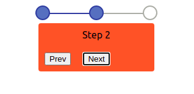

<!-- Logo -->
<p align="center"> 
    </img>
</p>

<h1 align="center">React Multi Stepper</h1> 
<h3 align="center"> Highly Customizable Multi Stepper Component for React 🚀 </h3>

<p align="center">
  <a href="https://hits.seeyoufarm.com"></a>
  <a href="https://nodejs.org/en/blog/release/v12.18.3/"></a>
  <a href="https://www.npmjs.com/package/npm/v/6.14.6"></a>
  <a href="https://www.gatsbyjs.com/"></a>
  <a href="https://github.com/prettier/prettier"></a>
  <br/>
  <a href="https://app.netlify.com/sites/awesome-loaders/deploys"></a>
  <a href="https://travis-ci.org/badges/badgerbadgerbadger"></a>
  <a href="http://badges.mit-license.org/"></a>
  <a href="https://github.com/ashutosh1919/react-awesome-loaders/commits/main"></a>
  <a href="https://awesome-loaders.netlify.app/"></a>
  <a href="https://img.shields.io/badge/price-free-ff69b4"></a>
</p>

<!-- Add GIF of working -->

:star: Star us on GitHub — it helps!  
To view a documentation website, [click here]()

# Getting Started 🎬

To use **Multi Step Form**, install the NPM package.

## Install NPM Package

```bash
npm install react-multi-step-form
```

## Import And Use

```jsx highlight={1,6}
import MultiContainer from "react-multi-step-form";
import MultiStepForm from "react-multi-step-form";
...
function MultiStepFormComponent(props) {
    const styles = {
                    background: "tomato",
                    padding: "10px",
                    margin: "5px",
                    borderRadius: "4px" }
    return (
        ...
        <MultiContainer>
            <MultiStepForm
                progressBar
                compStyle={styles}>
                <div>Step 1</div>
                <div>Step 2</div>
                <div>Step 3</div>
            </MultiStepForm>
        </MultiContainer>
        ...
    );
}
export default MultiStepFormComponent
```

<p align="center"> 
    </img>
</p>

The Multi Step Form is easy to import in any component.
The Form is responsive, totally customizable and with many features to change according to the user.  
You can provide a fixed width too for the form.
Read the complete in detail documentation on the [project website]().

# License 📄

<!-- This project is licensed under the MIT License - see the [LICENSE.md](https://github.com/ashutosh1919/react-awesome-loaders/blob/main/LICENSE) file for details.
You can use this project for personal as well as commercial purposes. But if you think you have modified the project and built something really good, we will humbly request you to raise the pull request and share with the opensource community. -->

<!-- Add LICENSE here -->

# Contributing 💡

We have provided detailed description on how & what to contribute to this project on [website](https://awesome-loaders.netlify.app/docs/contributing/). Please, take a look.

If you can help us with these. Please don't hesitate to open an [pull request](https://github.com/ashutosh1919/react-awesome-loaders/pulls) or [issue](https://github.com/ashutosh1919/react-awesome-loaders/issues).

# Contributors ✨

Thanks goes to these wonderful people ([emoji key](https://allcontributors.org/docs/en/emoji-key)):

<!-- ALL-CONTRIBUTORS-LIST:START - Do not remove or modify this section -->
<!-- prettier-ignore-start -->
<!-- markdownlint-disable -->
<table>
  <tr>
    <td align="center"><a href="https://github.com/AmeyaJain-25"><br /><sub><b>Ameya Jain</b></sub></a><br /><a href="https://github.com/AmeyaJain-25/" title="Code">💻</a> <a href="https://github.com/ashutosh1919/react-awesome-loaders/commits?author=ashutosh1919" title="Documentation">📖</a>
  </tr>
</table>

This project follows the [all-contributors](https://github.com/all-contributors/all-contributors) specification. Contributions of any kind welcome!
